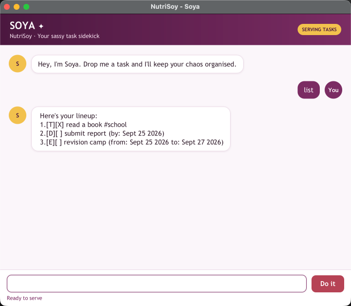

# NutriSoy — Soya User Guide

Meet **Soya**, NutriSoy's sassy task sidekick. NutriSoy is a desktop chatbot for
keeping todos, deadlines, events, and tags in one local task list.



Screenshot rendered from NutriSoy on macOS using sample tasks. The S and You
avatars are original JavaFX/CSS elements, created with AI assistance; see the
[acknowledgements](https://github.com/Eskalade/ip#acknowledgements).

[Quick start](#quick-start) · [Commands](#command-reference) ·
[Errors](#errors-and-recovery) · [Saved data](#your-saved-data)

## Quick start

1. Install Java 25 and download or clone the [project](https://github.com/Eskalade/ip).
   Open a terminal in the project directory.
2. Run `./gradlew run` (Windows: `gradlew.bat run`).
3. Type `todo read a book`, then press Enter or click **Do it**.
4. Type `list` to see saved tasks. Type `bye` to exit.

To build a JAR, run `./gradlew clean build`, then
`java -jar build/libs/nutrisoy.jar`. Build on the target OS/architecture because
JavaFX includes native components. Use a writable working directory.

If you already have a compatible `nutrisoy.jar`, put it in a writable folder,
open a terminal there, and run `java -jar nutrisoy.jar` with Java 25.
Keep using that folder so NutriSoy finds your saved tasks.

## Command reference

Replace uppercase placeholders with your own values; do not type the placeholders
or square brackets. Command words are case-insensitive. Leading/trailing spaces,
multiple spaces, and tabs between arguments are accepted. Date parameters such
as `/by` must be lowercase standalone tokens separated by whitespace.
Write dates as `yyyy-MM-dd`, for example `2026-09-25`.

| Action | Format | Example |
| --- | --- | --- |
| Show all tasks | `list` | `list` |
| Add a todo | `todo DESCRIPTION` | `todo read a book` |
| Add a deadline | `deadline DESCRIPTION /by DATE` | `deadline submit report /by 2026-09-25` |
| Add an event | `event DESCRIPTION /from DATE /to DATE` | `event revision camp /from 2026-09-25 /to 2026-09-27` |
| Complete a task | `mark INDEX` | `mark 1` |
| Reopen a task | `unmark INDEX` | `unmark 1` |
| Delete a task | `delete INDEX` | `delete 1` |
| Search descriptions | `find KEYWORD` | `find book` |
| Add a tag | `tag INDEX TAG` | `tag 1 school` |
| Remove a tag | `untag INDEX TAG` | `untag 1 school` |
| Exit | `bye` | `bye` |

Try this on an empty list: `todo read a book`, `tag 1 school`, `mark 1`,
then `list`. You should see `1.[T][X] read a book #school`. Use `unmark 1`
to reopen it and `untag 1 school` to remove the tag. `delete 1` permanently
removes the task; `bye` saves any pending changes and closes the app.

## Adding and managing tasks

`todo read a book` adds an incomplete task and reports the new total:

```text
Consider it handled. I added:
  [T][ ] read a book
Your list is now serving 1 task.
```

The prefixes `[T]`, `[D]`, and `[E]` identify todos, deadlines, and events.
`[ ]` means incomplete; `[X]` means done. Dates are stored as `yyyy-MM-dd` and
shown in a readable date format whose month names follow your system locale.

Use real dates, including valid leap days. Events must start before their end
date; same-day events are not supported. Each required parameter must appear
exactly once, and `/from` must precede `/to`.

Duplicate tasks have the same type, description (ignoring case), and dates.
Tags and completion status do not make an otherwise identical task distinct.
Task descriptions cannot be empty or contain `|`, which is reserved for storage.

Indexes start at **1** and refer to the complete `list` output. Deleting a task
renumbers subsequent tasks. Deletion has no undo command; check the index first.
Marking an already completed task or reopening an incomplete task gives an error.

## Finding tasks and adding tags

`find book` matches descriptions containing the exact substring `book`.
Searching is case-sensitive and does not search tags. A search result is numbered
as a separate result list: run `list` again before using an index to modify a task.

Tags start with an ASCII letter or digit and contain only letters, digits,
hyphens, or underscores. Enter `tag 1 school`, without a `#`; Soya adds `#` when
displaying it. Each command adds or removes one tag. Tag matching ignores case;
adding a duplicate tag or removing a missing tag reports an error.

## Errors and recovery

Errors appear in a red response bubble with an explanation. Correct the input
and try again. For example:

| Input/problem | Recovery |
| --- | --- |
| `deadline report /by 2026-02-30` | Supply a real calendar date |
| `event trip /from 2026-09-27 /to 2026-09-25` | Make the end date later than the start date |
| `mark 0` or an index beyond the list | Run `list` and use a displayed positive index |
| `list extra` or `bye now` | These commands take no arguments |
| Repeated `/by`, `/from`, or `/to` | Specify each required parameter once |
| No data file yet | Add your first task; NutriSoy creates the file automatically |
| Startup file warning | Back up and repair the data file, then restart |
| Save failure | Keep the app open, fix file access, then enter `list` to retry saving |

After a failed save, changes exist only in memory until a retry succeeds.
`bye` will not exit while saving fails. Closing the window with unsaved changes
asks for confirmation; choosing to discard loses those unsaved changes.

## Your saved data

Tasks are saved in `data/nutrisoy.txt`, relative to the **working directory**.
GUI and console modes share this location. Starting from a different directory
can look like an empty list because it uses a different data file.

Files are UTF-8 text. The current format is:

```text
T | 0 | read a book | school
D | 1 | submit report | 2026-09-25
E | 0 | revision camp | 2026-09-25 | 2026-09-27 | school,revision
```

`0` means incomplete, `1` means complete. The final comma-separated tag field is
optional. Older records without tags are supported, as are the previously
written tags-before-dates records when their dates can be identified.

On a partial or failed load, NutriSoy does not overwrite the original file.
Valid rows remain viewable; task changes are disabled until you repair the file
and restart. The warning identifies invalid line numbers. Keep a backup and
correct those rows using the format above. To intentionally start over, move
the original file to a backup location and restart.

Saves use a temporary file and atomic replacement to avoid truncating the old
file during writing. A filesystem that does not support atomic replacement
reports a save error; use a local writable folder. Avoid opening two instances
against the same file, since concurrent editing is not supported.

## Acknowledgements

See the [project README](https://github.com/Eskalade/ip#acknowledgements) for
the starter project, JavaFX tutorial, libraries, AI assistance, and avatar credits.
